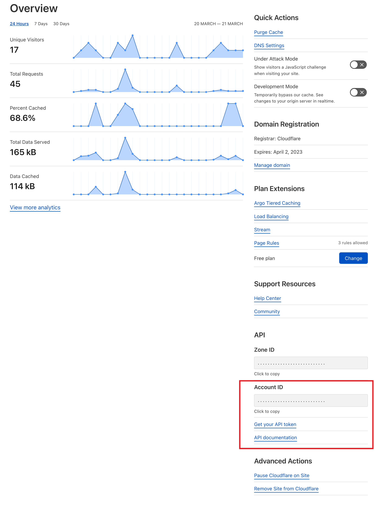
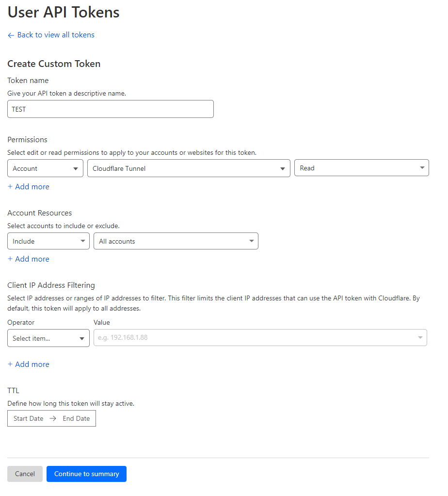

# Cloudflare Tunnel Monitor – Home Assistant Integration

Monitor your **Cloudflare Tunnels**, **connectors**, **sessions**, and **cloudflared version status** directly inside Home Assistant.

This is an enhanced and extended fork of the original integration by  
[@deadbeef3137](https://github.com/deadbeef3137/ha-cloudflare-tunnel-monitor),  
featuring major improvements, bug fixes, and advanced connector intelligence.

---

## ✨ Features

### ✔️ Monitor all Cloudflare Tunnels for an account  
Each Cloudflare account becomes a **Home Assistant device**, with one entity per tunnel.

### ✔️ Connector grouping & diagnostics  
Cloudflare exposes multiple raw “connections”.  
These are grouped by **client_id**, producing clean connector objects including:

- `client_id`
- `version`
- `sessions`
- `edges`
- `origin_ips`
- `pending_reconnect`
- `opened_at_latest`

Global attributes include:

- `connector_count`
- `session_count`

### ✔️ Cloudflared version tracking  
Automatically retrieves the latest cloudflared version from GitHub.

Per connector:

- `version`
- `latest_version`
- `is_latest`
- `update_available`
- `version_diff`

Global:

- `latest_cloudflared_version`

### ✔️ Device-based entity organization  
- 1 device per Cloudflare account  
- Multiple tunnels per account  
- Proper HA device identifiers and manufacturer metadata

### ✔️ Multi-language support  
Included translations:

- 🇬🇧 English  
- 🇳🇱 Dutch  
- 🇪🇸 Spanish  
- 🇵🇹 Portuguese  

### ✔️ HACS-compatible  
Works via custom repositories.

---

## 📦 Installation

### 🟦 Option 1 — HACS (recommended)

1. Go to **HACS → Integrations**
2. Click **⋯ → Custom repositories**
3. Add: `https://github.com/sammyke007/ha-cloudflare-tunnel-monitor` - Category: **Integration**
4. Install the integration
5. Restart Home Assistant

---

### 🟧 Option 2 — Manual installation

Copy the directory: `custom_components/cloudflare_tunnel_monitor` into: `/config/custom_components/`

Restart Home Assistant.

---

## 🔧 Configuration

### Step 1 — Get Cloudflare credentials

You need:

- **Account ID**

- **API Token** with:  
  `Account → Cloudflare Tunnel → Read`

### Step 2 — Add integration via UI

1. Go to **Settings → Devices & Services**
2. Click **Add Integration**
3. Search **Cloudflare Tunnel Monitor**
4. Enter:
   - Account ID  
   - API Token  
   - Friendly name (e.g. *Home*, *Parents*, *Brother*)

Home Assistant will create:

- 1 device for this account  
- 1 sensor per tunnel  
- Full connector + version attributes

---

## 📊 Example Tunnel Entity

A typical entity:

Attributes include:

- `status`
- `connector_count`
- `session_count`
- `connectors` (cleaned & grouped)
- `latest_cloudflared_version`
- per-connector version fields

---

A full example Lovelace card (Mushroom-based) is included in this repository:

👉 [`examples/lovelace_example.yaml`](https://github.com/sammyke007/ha-cloudflare-tunnel-monitor/blob/main/examples/lovelace_example.yaml)

This card shows:

- Tunnel status  
- Connector list  
- Session counts  
- Cloudflared version comparison  
- Edges (Cloudflare POPs)  
- Connector health and diagnostics  

You can simply replace the entity ID with your own tunnel sensor: ENTITY_ID ==> sensor.cloudflare_tunnel_friendlyname

---

## 🐞 Support & Issues

Report issues or request features here:

👉 https://github.com/sammyke007/ha-cloudflare-tunnel-monitor/issues

---

## ❤️ Credits

Original integration by **@deadbeef3137**  
Improved and maintained by **@sammyke007**

---

## 📄 License

This project is distributed under the **MIT License**.  
See the `LICENSE` file for details.

---

## ⚠️ Disclaimer

This project is **not affiliated with or endorsed by Cloudflare**.

